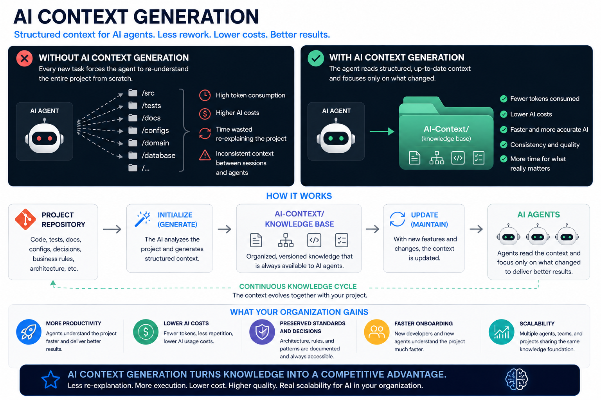

# AI Context Generation

A vendor-agnostic, workflow-only specification for creating and maintaining an
AI-readable knowledge base inside software projects. <br>
The workflow does not provide a parser, CLI, plugin, or runtime. Instead, it
defines instructions that an AI coding agent can follow directly.



## Governance

AI Context Generation is governed by a strict set of mandatory rules that define the boundaries of every workflow.

These rules ensure that agents remain inside the target repository, inspect only permitted dependencies, never download external resources, and rely only on observable evidence. This guarantees predictable, secure, and reproducible context generation across every project.

## Commands

### `initialize`

Creates the initial `ai-context` knowledge base by inspecting the current
project, its source code, tests, configuration, documentation, and repository
history when available.

`generate` is accepted as an alias for `initialize`.

### `update`

Updates the existing `ai-context` knowledge base after features, architectural
changes, business-rule changes, refactorings, or test-strategy changes.

## Generated directory

Copying this repository's `ai-context` folder into a target project gives it
everything needed to run the tool:

```text
ai-context/
└── agent/              (the tool — copy verbatim, never edit or generate into it)
    ├── AGENTS.md
    ├── workflows/
    │   ├── initialize.md
    │   └── update.md
    ├── templates/
    │   └── ...
    └── scripts/
        └── validate_context.py
```

Running `initialize` or `update` populates `ai-context/` itself — as siblings
of `agent/`, never inside it:

```text
ai-context/
├── agent/               (unchanged — the tool)
├── README.md
├── manifest.json
├── project-overview.md
├── business-context.md
├── domain-model.md
├── architecture.md
├── design-patterns.md
├── coding-standards.md
├── testing-strategy.md
├── feature-catalog.md
├── decisions.md
├── glossary.md
├── open-questions.md
└── change-log.md
```

## How to use

Clone this repository, then copy its `ai-context` folder — as a single unit —
into the target project:

```
cp -R ai-context-generation/ai-context [YOUR_REPOSITORY_FOLDER]/ai-context
```

Then, from inside the target project, instruct the coding agent with one of
these commands:

```text
Follow ai-context/agent/AGENTS.md and execute the initialize workflow.
```

```text
Follow ai-context/agent/AGENTS.md and execute the update workflow for the current changes.
```

The agent must inspect the repository, create or update the files in
`ai-context/` (never inside `ai-context/agent/`), report uncertainties, and
avoid inventing facts.

Before reporting either workflow complete, run the validator against the
generated directory:

```text
python3 ai-context/agent/scripts/validate_context.py ai-context
```

It requires no dependencies beyond the Python 3 standard library — nothing to
install. Resolve every `ERROR` line before finishing; `WARNING` lines are
judgment calls (for example, a duplicate line that's a genuine
false-positive).

## Design principles

- Vendor agnostic
- Human readable
- AI readable
- Repository grounded
- Incrementally maintainable
- Explicit about uncertainty
- No hidden runtime dependency
- No requirement for a parser
